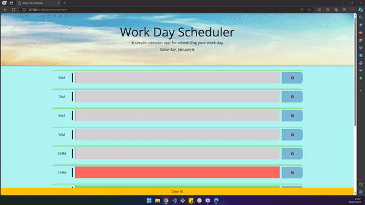

# Event Scheduling System

* Live Link: https://work-day-scheduler-seven.vercel.app/

This is a simple event scheduling system built with HTML, CSS, JavaScript/jQuery and the dayjs library. Allows users to schedule events for each hour of the day, view the current day, save events locally, and clear all events.

## Functionalities

- Display of the current day.
- Dynamic creation of time blocks for each hour of the day.
- Visual highlight for past, present and future hours.
- Saving and retrieving events locally.
- Clearing all events with confirmation.

## Usage

1. **Current Day View:**
    - The home page displays the current day at the top.

2. **Event Scheduling:**
    - Each hour of the day, from 6 AM to 5 PM, has a time block.
    - Click in the text area to add an event for the corresponding time.
    - The time block is visually highlighted with different colors for past, present and future.

3. **Event Saving:**
    - When adding an event, click the save icon to save the event locally.
    - Events are automatically retrieved when reloading the page.

4. **Event Cleanup:**
    - Click the "Clear All" button to clear all events.
    - A confirmation alert will be displayed before clearing all events.

## How to Start

1. Clone or download this repository. 
https://github.com/ramonsaguini/WorkDayScheduler
2. Open the `index.html` file in a web browser.

## Contributions

Contributions are welcome! Feel free to submit pull requests to improve this system.

## License

This project is licensed under the [MIT License](LICENSE).